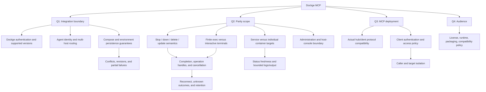

# Design interview

Status: first round awaiting answers. Recommendations are proposals, not accepted
architecture decisions. The invoked `grill-with-docs` skill combines an interview
with glossary and ADR updates. Implementation begins after shared understanding
is confirmed; repository creation and research were separately authorized.

## Authorized and completed

- Create `AI-Goes-Fast/dockge-mcp` on the configured Gitea instance.
- Work in `/workspace/homelab/dockge-mcp`.
- Clone Dockge for reference and review its source/docs.
- Review current official MCP server guidance.
- Conduct the design interview and record resolved terminology and decisions.

The repository starts private, matching the organization visibility. Public
distribution and licensing remain open.

## Round 1: current frontier

| Question | Recommendation | Owner's answer |
| --- | --- | --- |
| Q1: Integration boundary: Dockge Socket.IO, direct Docker/Compose, or both? | Authenticated remote Socket.IO adapter to Dockge; declare compatibility. | Pending |
| Q2: UI parity: operations, complete administration, or original tools first? | Operational parity: stack/service actions, editing, deployment, status/logs, scoped terminals. | Pending |
| Q3: MCP deployment: HTTP via homelab hub, local stdio, or both? | Container with Streamable HTTP via hub. | Pending |
| Q4: Audience: reusable project, homelab only, or public first release? | Reusable project with homelab as first deployment. | Pending |

## Design tree

Later rounds will resolve each branch once its prerequisites are answered. Concrete
scenarios to examine include two agents with the same stack name, edits racing the
UI, a lost connection during an update, a stopped stack being updated, services
with multiple replicas, images without bash, and a failed deploy after files were
already saved. Upstream source findings may make some proposed tools unsupported
without an upstream fix or a deliberately broader backend.

No architectural ADR has been accepted yet. Record one only for a significant
resolved trade-off; do not turn every implementation choice into an ADR.
