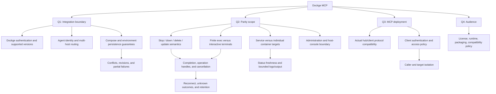

# Design interview

Status: accepted design; initial implementation underway (2026-09-30). The
owner completed the interview, configured the source mirror and instructed the
next work. The invoked grill-with-docs workflow recorded the glossary and ADRs.

## Authorized and completed

- Create `AI-Goes-Fast/dockge-mcp` on the configured Gitea instance.
- Work in `/workspace/homelab/dockge-mcp`.
- Clone Dockge for reference and review its source/docs.
- Review current official MCP server guidance.
- Conduct the design interview and record resolved terminology and decisions.

The Gitea repository starts private, matching the organization visibility.
MIT licensing, public GitHub Actions builds, and GHCR distribution are now
accepted. Public GitHub owner is `realbeepmcjeep`; Gitea remains authoritative
with a one-way push mirror to GitHub.

## Round 1: accepted

| Question | Recommendation | Owner's answer |
| --- | --- | --- |
| Q1: Integration boundary: Dockge Socket.IO, direct Docker/Compose, or both? | Authenticated remote Socket.IO adapter to Dockge; declare compatibility. | Accepted |
| Q2: UI parity: operations, complete administration, or original tools first? | Operational parity: stack/service actions, editing, deployment, status/logs, scoped terminals. | Accepted |
| Q3: MCP deployment: HTTP via homelab hub, local stdio, or both? | Container with Streamable HTTP via hub. | Accepted |
| Q4: Audience: reusable project, homelab only, or public first release? | Reusable project with homelab as first deployment. | Accepted |

## Round 2: answered

| Question | Recommendation | Owner's answer |
| --- | --- | --- |
| Q5: One primary Dockge plus its registered agents, or multiple independently configured instances? | One primary plus its registered agents; explicit agent/stack identity on mutations. | Accepted |
| Q6: Service-level tools or individual container-instance management? | `service_*` lifecycle tools matching Dockge; container names/stats are observational. | Follow native Dockge UI/UX for the supported release. No broader container manager. |
| Q7: Shell fidelity and scope? | Opt-in bounded service shell sessions reflecting the shared Dockge terminal; no promise of isolated one-shot exec. | Defer shells; potentially valuable future capability. |
| Q8: Behavior when a configured Dockge profile cannot perform an operation reliably? | Return an explicit unsupported result; no hidden filesystem, Docker, or host-console fallback. | Accepted after examples in round 3. |
| Q9: Faithful Dockge lifecycle semantics or custom behavior? | Separate save/deploy/stop/down/delete; update stopped stacks only pulls; return CLI completion separately from readiness. | Accepted: faithful. |
| Q10: Trusted shared service identity or per-person/multi-tenant identities? | One trusted deployment identity with configurable capabilities/targets; document the trust boundary. | Accepted: keep initial access model simple; deferred work/testing goes to TODO. |
| Q11: Editor contract? | Complete document replacement with a required last-read content hash; omitted environment is preserved, with best-effort conflict detection and no claim of atomic concurrency protection. | Accepted |
| Q12: Runtime/distribution/license? | TypeScript on supported Node LTS, container-first packaging, npm entrypoint, MIT license. | Owner selected JavaScript/TypeScript with Bun after Rust research. MIT accepted in round 4. |
| Q13: Supported Dockge/MCP baseline? | Released Dockge 1.5.0 with an explicit profile; MCP 2025-11-25 for the current hub. Add other profiles/protocols after testing. | Accepted; owner reports live Dockge displays 1.5.0. SDK implementation depends on Q12. |

Release comparison found that tag `1.5.0` persists `.env`, while reviewed master
does not. Released 1.5.0 lacks the master's service lifecycle handlers and uses
a different service-status response shape, despite the same package version.
Q8 concerns unsupported behavior generally. Q11 requires refusing
stale edits where detectable, but Dockge has no atomic compare-and-swap API; an
upstream UI edit after preflight remains possible.

## Round 3: answered

| Question | Recommendation | Owner's answer |
| --- | --- | --- |
| Q8 follow-up: unsupported feature versus unknown result? | Known unavailable features fail before dispatch; lost mutation responses remain unknown and are reconciled, never blindly retried. See unsupported-scenarios.md. | Accepted |
| Q12 follow-up: Rust versus TypeScript? | Rust binary plus Docker wrapper, subject to an initial Socket.IO/HTTP/static-packaging validation milestone. MIT remains proposed. See research/runtime.md. | Owner selected JavaScript/TypeScript with Bun; use TypeScript as a routine implementation choice. No Rust implementation. MIT accepted in round 4. |
| Q14: Slow operations: blocking calls or operation handles? | Mutations return an operation handle; operation_status/operation_logs report command completion independently of request lifetime. | Accepted |
| Q15: Overlapping operations on a stack? | One mutation at a time per agent/stack; reject busy requests instead of silently queuing stale actions. | Accepted |
| Q16: Initial authentication/network boundary? | Private hub-reachable HTTP listener, one MCP bearer key, separately configured Dockge credentials. No per-person identity machinery initially. | Accepted |
| Q17: Read/output contract? | Finite bounded log snapshots; YAML available for editing; environment values redacted by default with explicit authorized retrieval. Omitted environment edits preserve existing values. | Accepted, with explicit separate operations/permissions for environment retrieval and modification. |

## Accepted environment boundary

"Environment content" means the stack's `.env` file. Global environment/settings
remain outside the accepted operational scope. General stack reads and writes
must not expose or accept `.env` content. Dedicated environment read and write
tools require independent `env_read` and `env_write` permissions; ordinary stack
read/write permissions do not imply either. Internal reads needed to preserve
existing `.env` during a YAML save do not grant model-visible retrieval.

Use the same agent/stack mutation lock and revision/conflict checks for dedicated
environment edits. Upstream `saveStack` writes both YAML and environment on the
released baseline: preserve the untouched document, verify results, and retain
the already documented limitation that upstream has no atomic compare-and-swap.
The boundary controls explicit `.env` operations, not every possible secret in
YAML or application logs. Environment content must not leak through operation
results, audit messages, or diagnostics.

Requests for logs remain observational; interactive shell/exec is deferred.
Operation retention/restart recovery was accepted in round 4. Authentication
details and live-profile verification still require the configured Dockge URL;
credentials should be supplied through configuration, not pasted into the chat.

## Round 4: accepted

| Question | Recommendation | Owner's answer |
| --- | --- | --- |
| Q18: Environment permission defaults? | `env_read` and `env_write` are independent, both disabled until configured; env-write can be enabled without env-read. | Accepted |
| Q19: Operation persistence/recovery? | Bun SQLite ledger, bounded sanitized output retained 24h; interrupted operations become unknown and retain their stack guard until reconciled or explicitly cleared. No replay. | Accepted |
| Q20: Environment write applies immediately or saves only? | Save only; deploy/start is a separate operation for Compose to apply changes. Ordinary restart does not apply changed configuration. | Accepted |
| Q21: Distribution artifacts? | Docker image first, plus a compiled Bun executable; initially test Linux x64/arm64. | Accepted; add public GitHub Actions automatic builds and GHCR publishing. |
| Q22: License? | MIT. Runtime changes did not settle the earlier license question. | Accepted |

## GitHub publishing: accepted

| Question | Recommendation | Owner's answer |
| --- | --- | --- |
| GitHub owner for public dockge-mcp and GHCR namespace? | Use the owner's chosen GitHub user/organization; do not infer it from Gitea's organization name. | realbeepmcjeep |
| Source of truth and mirror direction? | Gitea remains development source; one-way push mirror to public GitHub for Actions/releases. | Accepted |

The public GitHub repository and one-way Gitea push mirror are configured.
The bridge never receives the mirror PAT. The reviewable tool inventory and
accepted semantics are in contract.md; build/release policy is in publishing.md.

Read-only research is checking actual hub/client compatibility and Dockge release
behavior. The configured `/mcp/paseo-pi` route negotiated MCP 2025-11-25 even when
2026-07-28 was requested. No primary Dockge URL was discoverable in available
workspace/configuration, so live Dockge compatibility still requires its URL.
Live configuration/verification remains acceptance work. Architecture decisions
are settled; shell sharing and advanced
per-person access stay deferred. Reversible implementation defaults for timeouts,
payload bounds, and naming will be documented during implementation.

## Design tree

Acceptance scenarios include duplicate stack names across agents, UI edits racing
MCP edits, lost update responses, stopped-stack updates, and a failed deploy after
files were saved. Shared shells and replica-targeted execution are deferred.

Accepted architectural trade-offs are recorded in `docs/adr/`. Record additional
ADRs only for significant resolved trade-offs; do not turn every implementation
choice into an ADR.
