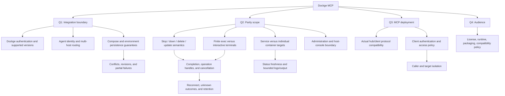

# Design interview

Status: round 1 accepted (2026-09-30); round 2 awaiting answers. Unanswered
recommendations remain proposals. The invoked `grill-with-docs` skill combines an interview
with glossary and ADR updates. Implementation begins after shared understanding
is confirmed; repository creation and research were separately authorized.

## Authorized and completed

- Create `AI-Goes-Fast/dockge-mcp` on the configured Gitea instance.
- Work in `/workspace/homelab/dockge-mcp`.
- Clone Dockge for reference and review its source/docs.
- Review current official MCP server guidance.
- Conduct the design interview and record resolved terminology and decisions.

The repository starts private, matching the organization visibility. Public
distribution and licensing remain open.

## Round 1: accepted

| Question | Recommendation | Owner's answer |
| --- | --- | --- |
| Q1: Integration boundary: Dockge Socket.IO, direct Docker/Compose, or both? | Authenticated remote Socket.IO adapter to Dockge; declare compatibility. | Accepted |
| Q2: UI parity: operations, complete administration, or original tools first? | Operational parity: stack/service actions, editing, deployment, status/logs, scoped terminals. | Accepted |
| Q3: MCP deployment: HTTP via homelab hub, local stdio, or both? | Container with Streamable HTTP via hub. | Accepted |
| Q4: Audience: reusable project, homelab only, or public first release? | Reusable project with homelab as first deployment. | Accepted |

## Round 2: current frontier

| Question | Recommendation | Owner's answer |
| --- | --- | --- |
| Q5: One primary Dockge plus its registered agents, or multiple independently configured instances? | One primary plus its registered agents; explicit agent/stack identity on mutations. | Pending |
| Q6: Service-level tools or individual container-instance management? | `service_*` lifecycle tools matching Dockge; container names/stats are observational. | Pending |
| Q7: Shell fidelity and scope? | Opt-in bounded service shell sessions reflecting the shared Dockge terminal; no promise of isolated one-shot exec. | Pending |
| Q8: Behavior when a configured Dockge profile cannot perform an operation reliably? | Return an explicit unsupported result; no hidden filesystem, Docker, or host-console fallback. | Pending |
| Q9: Faithful Dockge lifecycle semantics or custom behavior? | Separate save/deploy/stop/down/delete; update stopped stacks only pulls; return CLI completion separately from readiness. | Pending |
| Q10: Trusted shared service identity or per-person/multi-tenant identities? | One trusted deployment identity with configurable capabilities/targets; document the trust boundary. | Pending |
| Q11: Editor contract? | Complete document replacement with a required last-read content hash; omitted environment is preserved, with best-effort conflict detection and no claim of atomic concurrency protection. | Pending |
| Q12: Runtime/distribution/license? | TypeScript on supported Node LTS, container-first packaging, npm entrypoint, MIT license. | Pending |
| Q13: Supported Dockge/MCP baseline? | Released Dockge 1.5.0 with an explicit profile; MCP 2025-11-25 for the current hub using maintained SDK v1. Add other profiles/protocols after testing. | Pending |

Release comparison found that tag `1.5.0` persists `.env`, while reviewed master
does not. Released 1.5.0 lacks the master's service lifecycle handlers and uses
a different service-status response shape, despite the same package version.
Q8 concerns unsupported behavior generally. Q11 requires refusing
stale edits where detectable, but Dockge has no atomic compare-and-swap API; an
upstream UI edit after preflight remains possible.

Read-only research is checking actual hub/client compatibility and Dockge release
behavior. The configured `/mcp/paseo-pi` route negotiated MCP 2025-11-25 even when
2026-07-28 was requested. No primary Dockge URL was discoverable in available
workspace/configuration, so live Dockge compatibility still requires its URL.
Questions that depend on remaining facts stay deferred. Later rounds
will settle downstream authentication, HTTP exposure, operation recovery,
output limits/secret handling, shell sharing/session behavior, and acceptance
criteria once their prerequisites are answered.

## Design tree

Later rounds will resolve each branch once its prerequisites are answered. Concrete
scenarios to examine include two agents with the same stack name, edits racing the
UI, a lost connection during an update, a stopped stack being updated, services
with multiple replicas, images without bash, and a failed deploy after files were
already saved. Upstream source findings may make some proposed tools unsupported
without an upstream fix or a deliberately broader backend.

Accepted architectural trade-offs are recorded in `docs/adr/`. Record additional
ADRs only for significant resolved trade-offs; do not turn every implementation
choice into an ADR.
